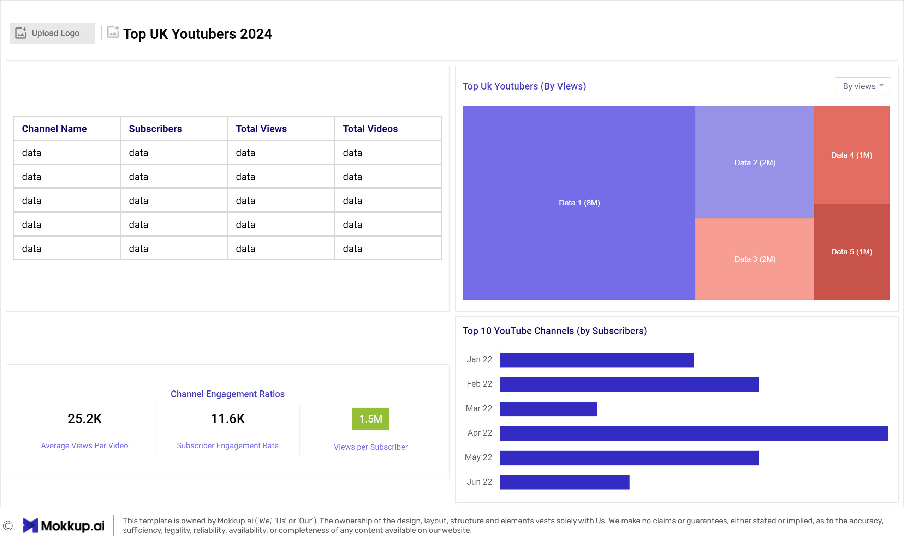

# Top UK Youtubers 2024


# Table of Contents

- [Objective](#objective)
- [Data Source](#data-source)
- [Stages](#stages)
- [Design](#design)
  - [Mockup](#mockup)
  - [Tools](#tools)
- [Development](#development)
   - [Pseudocode](#pseudocode)
   - [Data Exploration](#data-exploration)
   - [Data Cleaning](#Ddata-cleaning)
   - [Transform the Data](#transform-the-data)
  - [Create the SQL View](#create-the-sql-view)
- [Testing](#testing)
  - [Data Quality Tests](#data-quality-tests)
- [Visualization](#visualization)
  - [Results](#results)
  - [DAX Measures](#dax-measures)
- [Analysis](#analysis)
  - [Findings](#findings)
  - [Validation](#validation)
  - [Discovery](#discovery)
- [Recommendations](#recommendations)
  - [Potential ROI](#potential-roi)
  - [Potential Courses of Actions](#potential-courses-of-actions)
- [Conclusion](#conclusion)


# Objective

- What is the key objective of the project?

To discover the top performing UK Youtubers to form marketing collaborations with, throughout the year 2024.


- What is the best solution?

  To create a Dashboard that provides insights into the top UK Youtubers in 2024 which includes
  - Subscriber COunt
  - Total Views
  - Total Videos, and
  - Engagement Metrics

  This data will help the marketing team make informed decision about which Youtubers to collaborate with for marketing campaigns, to obtain maximum returns.


## User Story

As the Head of Marketing, I want to identify the top YouTubers in the UK based on subscriber count, videos uploaded and views accumulated, so that I can decide on which channels would be best to run marketing campaigns with to generate a good ROI.


# Data source 

- What data is needed to achieve our objective?

We need data on the top UK YouTubers in 2024 that includes their 
- Channel Names
- Total Subscribers
- Total Views
- Total Videos Uploaded

  
- Where is the data coming from? 
The data is sourced from Kaggle (an Excel extract), [see here to find it.](https://www.kaggle.com/datasets/bhavyadhingra00020/top-100-social-media-influencers-2024-countrywise?resource=download)


# Stages

- Design
- Developement
- Testing
- Analysis


# Design

## Dashboard components required 
- What should the dashboard contain based on the requirements provided?

To understand what it should contain, we need to figure out what questions we need the dashboard to answer:

1. Who are the top 10 YouTubers with the most subscribers?
2. Which 3 channels have uploaded the most videos?
3. Which 3 channels have the most views?
4. Which 3 channels have the highest average views per video?
5. Which 3 channels have the highest views per subscriber ratio?
6. Which 3 channels have the highest subscriber engagement rate per video uploaded?
  
  
## Dashboard mockup

- What should it look like? 

Some of the data visuals that may be appropriate in answering our questions include:

1. Table
2. Treemap
3. Scorecards
4. Horizontal bar chart 





## Tools Used


| Tool | Purpose |
| --- | --- |
| Excel | Exploring the data |
| SQL Server | Cleaning, testing, and analyzing the data |
| Power BI | Visualizing the data via interactive dashboards |
| GitHub | Hosting the project documentation |
| Mokkup AI | Designing the mockup of the dashboard | 


# Development

## Pseudocode

- How can we approach the problem to create a solution from start to finish?

  1. Get the data from a reliable data source
  2. Explore the data in Excel to check for any errors that standout
  3. Load the data into SQL Server
  4. Clean the data with SQL
  5. Test the data with SQL
  6. Load the clean data into PowerBI
  7. Generate visualisations of the data in PowerBI
  8. Generate the findings based on the insights
  9. Write the documentation + commentary
  10. Publish the insights generated


## Data exploration notes

This is the stage where we scan the data for errors, inconcsistencies, bugs, weird and corrupted characters etc. 


- What are the initial observations with this dataset? What's caught our attention so far? 

1. There are at least 4 columns that contain the data we need for this analysis, which signals we have everything we need from the file without needing to contact the client for any more data. 
2. The first column contains the channel ID with what appears to be channel IDS, which are separated by a @ symbol - we need to extract the channel names from this.
3. Some of the cells and header names are in a different language - we need to confirm if these columns are needed, and if so, we need to address them.
4. We have more data than we need, so some of these columns would need to be removed


## Data cleaning 
- What do we expect the clean data to look like? What should it contain? What contraints should we apply to it?

The aim is to refine the dataset to ensure it is structured and ready for analysis. 

The cleaned data should meet the following criteria and constraints:

- Only relevant columns should be retained.
- All data types should be appropriate for the contents of each column.
- No column should contain null values, indicating complete data for all records.

Below is a table outlining the constraints on our cleaned dataset:

| Property | Description |
| --- | --- |
| Number of Rows | 100 |
| Number of Columns | 4 |

And here is a tabular representation of the expected schema for the clean data:

| Column Name | Data Type | Nullable |
| --- | --- | --- |
| channel_name | VARCHAR | NO |
| total_subscribers | INTEGER | NO |
| total_views | INTEGER | NO |
| total_videos | INTEGER | NO |


- What steps are needed to clean and shape the data into the desired format?

1. Remove unnecessary columns by only selecting the ones you need
2. Extract Youtube channel names from the first column
3. Rename columns using aliases


### Transform the data


```sql
/* 
Data Cleaning Steps
1. Remove Unnecessary columns by only selecting the ones we need.
2. Extract the Youtube channel names from the first column.
3. Rename the column names.
*/

SELECT 
    NOMBRE, total_subscribers, total_videos, total_views
FROM
    top_uk_youtubers_2024;

SELECT 
    SUBSTRING(Nombre,
            1,
            LOCATE('@', Nombre) - 1)
            AS Channel_Name, total_subscribers, total_views, total_videos
FROM
    top_uk_youtubers_2024
```


### Create the SQL view

```sql
/*
# 1. Create a view to store the transformed data
# 2. Cast the extracted channel name as VARCHAR(100)
# 3. Select the required columns from the top_uk_youtubers_2024 SQL table 
*/

-- 1.
CREATE VIEW view_uk_youtubers_2024 AS

-- 2.
SELECT
   CAST(SUBSTRING(Nombre,
            1,
            LOCATE('@', Nombre) - 1)
        AS CHAR (100)) AS Channel_Name, total_subscribers, total_views, total_videos

-- 3.
FROM
    top_uk_youtubers_2024
```

# Testing

Here are the data quaity tests conducted

## Row Count check
```sql
/*
Data Quality Tests

1. The data needs to be 100 records of youtube channels (row count check). --- (passed)
*/

SELECT
    COUNT(*) AS no_of_rows
FROM
    view_uk_youtubers_2024;

```

## Column Count check
```sql
/*
Data Quality Tests

2. The data needs 4 fields (column count test). --- (passed)
*/

SELECT 
    COUNT(*) AS coulmns_count
FROM
    Information_Schema.Columns
WHERE
    table_name = 'view_uk_youtubers_2024';
```

## Data Type check
```sql
/*
Data Quality Tests

3. Channel name column must be string format and the other columns must be numerical data types (data type check). --(passed)
*/

SELECT 
    Column_name, Data_type
FROM
    Information_Schema.Columns
WHERE
    table_name = 'view_uk_youtubers_2024';
```

## Duplicate Count check
```sql
/*
Data Quality Tests

4. Each record must be unique in the dataset (duplicate count check). -- (passed)
*/

SELECT 
    channel_name, COUNT(*) AS duplicate
FROM
    view_uk_youtubers_2024
GROUP BY channel_name
HAVING COUNT(*) > 1
```


# Visualisation

## Results

- What does the dashboard look like?


This is an interactive dashboard shwoing the Top Uk Youtubers in 2024 so far


## DAX Measures
### 1. Total Subscribers (M)
```sql
Total Subscribers (M) = 
VAR million = 1000000
VAR sumOfSubscribers = SUM(view_uk_youtubers_2024[total_subscribers])
VAR totalSubscribers = DIVIDE(sumOfSubscribers,million)

RETURN totalSubscribers

```

### 2. Total Views (B)
```sql
Total Views (B) = 
VAR billion = 1000000000
VAR sumOfTotalViews = SUM(view_uk_youtubers_2024[total_views])
VAR totalViews = ROUND(sumOfTotalViews / billion, 2)

RETURN totalViews

```

### 3. Total Videos
```sql
Total Videos = 
VAR totalVideos = SUM(view_uk_youtubers_2024[total_videos])

RETURN totalVideos

```

### 4. Average Views Per Video (M)
```sql
Average Views per Video (M) = 
VAR sumOfTotalViews = SUM(view_uk_youtubers_2024[total_views])
VAR sumOfTotalVideos = SUM(view_uk_youtubers_2024[total_videos])
VAR  avgViewsPerVideo = DIVIDE(sumOfTotalViews,sumOfTotalVideos, BLANK())
VAR finalAvgViewsPerVideo = DIVIDE(avgViewsPerVideo, 1000000, BLANK())

RETURN finalAvgViewsPerVideo 

```


### 5. Subscriber Engagement Rate
```sql
Subscriber Engagement Rate = 
VAR sumOfTotalSubscribers = SUM(view_uk_youtubers_2024[total_subscribers])
VAR sumOfTotalVideos = SUM(view_uk_youtubers_2024[total_videos])
VAR subscriberEngRate = DIVIDE(sumOfTotalSubscribers, sumOfTotalVideos, BLANK())

RETURN subscriberEngRate 

```


### 6. Views per subscriber
```sql
Views Per Subscriber = 
VAR sumOfTotalViews = SUM(view_uk_youtubers_2024[total_views])
VAR sumOfTotalSubscribers = SUM(view_uk_youtubers_2024[total_subscribers])
VAR viewsPerSubscriber = DIVIDE(sumOfTotalViews, sumOfTotalSubscribers, BLANK())

RETURN viewsPerSubscriber 

```

  
